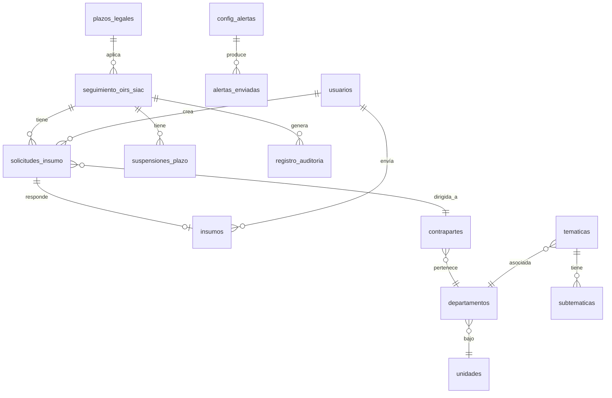

# Documento de Diseño: Gestión OIRS Backend

## Resumen

Este documento describe la arquitectura técnica para la capa de gestión del sistema OIRS del SLEP Valparaíso. La solución extiende la aplicación existente (Ionic Angular 17 + Supabase) con servicios de backend que permiten rastrear insumos en paralelo, calcular plazos legales en días hábiles, enviar alertas configurables y mantener un catálogo interno administrable.

La pieza central es el **Rastreador de Insumos en Paralelo** (R6): permite al equipo SIAC solicitar aportes a múltiples áreas simultáneamente sin perder el rastro.

**Decisiones clave:**
- Todo el backend se implementa como **Supabase Edge Functions** (Deno/TypeScript) + funciones PostgreSQL + RLS.
- Los datos de gestión viven en tablas separadas de la tabla de ingesta (`seguimiento_oirs_siac`), respetando la restricción de integridad (R11).
- El Motor de Plazos es una función PostgreSQL que recalcula diariamente + al crear/modificar solicitudes.
- Las notificaciones se envían vía correo usando un servicio externo (Resend/SendGrid) invocado desde Edge Functions.

## Arquitectura

```mermaid
graph TB
    subgraph "Cliente (Ionic Angular 17)"
        FE[Frontend App]
    end

    subgraph "Supabase"
        subgraph "Edge Functions"
            EF_SYNC[sync-oirs<br/>Ingesta eventos + reconciliación]
            EF_GESTION[gestion-oirs<br/>API de gestión]
            EF_ALERTAS[evaluar-alertas<br/>Cron: evalúa reglas]
            EF_PLAZOS[recalcular-plazos<br/>Cron: motor de plazos]
        end

        subgraph "PostgreSQL"
            T_SEG[seguimiento_oirs_siac<br/>(ingesta - autoritativa)]
            T_SOL[solicitudes_insumo]
            T_INS[insumos]
            T_SUS[suspensiones_plazo]
            T_CAT[Catálogo Interno<br/>tematicas, departamentos,<br/>unidades, plazos_legales]
            T_AUD[registro_auditoria]
            T_ALR[alertas_enviadas]
            T_CFG[config_alertas]
            T_FER[feriados]
            T_USR[usuarios]
            FN_PLAZOS[fn: calcular_dias_habiles<br/>fn: calcular_vencimiento]
        end

        RLS[Row Level Security]
    end

    subgraph "Externo"
        SIMPLE[API SIMPLE]
        MAIL[Servicio de correo<br/>(Resend/SendGrid)]
    end

    FE --> |Supabase Client| RLS
    RLS --> T_SEG & T_SOL & T_INS & T_CAT & T_AUD
    FE --> |invoke| EF_GESTION
    EF_SYNC --> |upsert| T_SEG
    EF_SYNC --> |audit| T_AUD
    EF_GESTION --> T_SOL & T_INS & T_SUS & T_CAT & T_AUD
    EF_ALERTAS --> T_CFG & T_ALR & T_SOL
    EF_ALERTAS --> MAIL
    EF_PLAZOS --> FN_PLAZOS
    EF_PLAZOS --> T_SEG & T_SUS & T_FER
    SIMPLE --> |webhook POST| EF_SYNC
    EF_SYNC --> |GET detalle| SIMPLE
```

### Principios arquitectónicos

1. **Separación ingesta/gestión**: las tablas de gestión (`solicitudes_insumo`, `insumos`, `suspensiones_plazo`) son independientes de `seguimiento_oirs_siac`. La ingesta nunca toca tablas de gestión.
2. **Seguridad en capas**: RLS + validación en Edge Function + token/API_KEY según contexto.
3. **Idempotencia**: tanto la ingesta por eventos como la reconciliación son idempotentes.
4. **Auditoría completa**: toda operación de gestión y todo cambio de ingesta observable genera un registro inmutable.

## Componentes e Interfaces

### 1. Edge Function: `gestion-oirs` (API de gestión)

Endpoint principal para operaciones de gestión. Usa JWT de sesión Supabase para autenticación.

```
POST /functions/v1/gestion-oirs
Authorization: Bearer <supabase_access_token>
Content-Type: application/json

Body: { "action": "<accion>", "payload": { ... } }
```

**Acciones disponibles:**

| Acción | Rol requerido | Descripción |
|--------|--------------|-------------|
| `crear_solicitud_insumo` | SIAC | Crea solicitud de insumo (R6.1) |
| `cancelar_solicitud` | SIAC | Cancela solicitud (R6.5) |
| `reasignar_solicitud` | SIAC | Cierra y crea nueva (R6.4) |
| `solicitar_info_adicional` | SIAC | Pide más info sobre solicitud existente (R6.6) |
| `enviar_insumo` | Contraparte | Registra insumo con texto/adjuntos (R7.1) |
| `clasificar_tramite` | SIAC | Asigna etiquetas internas (R3.7) |
| `suspender_plazo` | SIAC | Registra suspensión (R5.1) |
| `reanudar_plazo` | SIAC | Registra reanudación (R5.3) |
| `reenviar_alerta` | SIAC | Reenvío manual de alerta (R8.5) |
| `crud_catalogo` | Admin | CRUD de catálogo interno (R3.1-3.6) |
| `crud_config_alertas` | Admin | CRUD de reglas de notificación (R9) |
| `crud_plazos_legales` | Admin | CRUD de plazos por tipo (R4.5) |
| `crud_feriados` | Admin | CRUD de feriados (R4.4) |

**Flujo interno:**
1. Extraer JWT → verificar usuario autenticado (401 si no)
2. Obtener rol del usuario desde tabla `usuarios`
3. Validar que el rol permite la acción (403 si no)
4. Ejecutar lógica de negocio
5. Registrar en `registro_auditoria`
6. Retornar resultado

### 2. Edge Function: `sync-oirs` (Ingesta — refactorizada)

Se extiende la función existente para soportar:

**Modo evento (webhook):**
```
POST /functions/v1/sync-oirs
X-API-Key: <secreto_env>
Content-Type: application/json

Body: { "event": "tarea_completada", "tramite_id": 12345, "tarea_id": 55 }
```

- Valida API_KEY contra `SIMPLE_WEBHOOK_API_KEY` (env var)
- Idempotente: re-procesar el mismo evento no cambia estado
- Tolerante a desorden: no revierte etapa si ya hay una posterior

**Modo reconciliación (cron diario):**
```
POST /functions/v1/sync-oirs
Authorization: Bearer <service_role_key>
Body: { "scheduled": true, "mode": "reconciliation" }
```

- Se ejecuta 1x/día (10:00 UTC) en lugar del actual cada-10-min
- Compara SIMPLE vs Supabase, repara diferencias
- Usa advisory lock para impedir ejecuciones solapadas (R11.8)

**Lógica de upsert con auditoría (R11.3):**
```typescript
// Pseudocódigo
for (campo of COLUMNAS_AUTORITATIVAS) {
  if (valorAnterior !== valorNuevo) {
    insertAudit({ tramite_id, campo, valorAnterior, valorNuevo, origen: 'ingesta' });
  }
}
upsert(seguimiento_oirs_siac, datos);
```

### 3. Edge Function: `evaluar-alertas` (Servicio de Notificaciones)

Cron que evalúa reglas de alerta. Se ejecuta cada hora en horario laboral (8:00-18:00 Chile, L-V).

```
POST /functions/v1/evaluar-alertas
Authorization: Bearer <service_role_key>
Body: { "scheduled": true }
```

**Lógica:**
1. Cargar reglas activas desde `config_alertas`
2. Para cada regla, consultar entidades que la disparan:
   - Solicitudes_insumo con `dias_restantes_interno <= anticipacion`
   - Trámites con `dias_restantes <= anticipacion`
3. Filtrar: excluir respondidos/cerrados (R8.6)
4. Filtrar: excluir ya alertados para ese (entidad, tipo, regla) → `alertas_enviadas` (R8.4)
5. Resolver destinatarios según configuración
6. Enviar correo vía Resend/SendGrid
7. Registrar en `alertas_enviadas`

### 4. Edge Function: `recalcular-plazos` (Motor de Plazos)

Cron diario (06:00 UTC = 02:00/03:00 Chile) que recalcula plazos.

**Lógica:**
1. Obtener trámites abiertos (estado_funcional NOT IN ('respondido', 'cerrado'))
2. Para cada trámite:
   - Obtener tipo_solicitud → plazo_legal desde tabla `plazos_legales`
   - Obtener suspensiones activas/históricas desde `suspensiones_plazo`
   - Calcular fecha_vencimiento usando `calcular_vencimiento(fecha_ingreso, plazo_legal, suspensiones, feriados)`
   - Calcular dias_restantes usando `calcular_dias_habiles(hoy, fecha_vencimiento, feriados)`
   - Si fecha_vencimiento cae en día no hábil → desplazar al siguiente
3. Actualizar `seguimiento_oirs_siac` (columnas: `fecha_vencimiento`, `dias_restantes`, `estado_funcional`)
4. Si falla → reintentar 3 veces con backoff (R4.12)

**Funciones PostgreSQL auxiliares:**

```sql
-- Calcula días hábiles entre dos fechas excluyendo fines de semana y feriados
CREATE FUNCTION calcular_dias_habiles(
  fecha_inicio DATE,
  fecha_fin DATE,
  territorio TEXT DEFAULT 'nacional'
) RETURNS INTEGER;

-- Calcula fecha de vencimiento sumando N días hábiles desde una fecha
CREATE FUNCTION calcular_vencimiento(
  fecha_ingreso TIMESTAMPTZ,
  plazo_dias_habiles INTEGER,
  dias_suspendidos INTEGER DEFAULT 0,
  territorio TEXT DEFAULT 'valparaiso'
) RETURNS DATE;
```

### 5. Catálogo Interno (R3)

Tablas administrables por Rol_Admin. Valores desactivados se excluyen de selectores pero se conservan en registros existentes.

## Modelos de Datos

### Diagrama Entidad-Relación



### Tablas nuevas

#### `solicitudes_insumo` (R6)

```sql
CREATE TABLE solicitudes_insumo (
  id UUID PRIMARY KEY DEFAULT gen_random_uuid(),
  tramite_id UUID NOT NULL REFERENCES seguimiento_oirs_siac(id),
  
  -- Destinatario (snapshot al momento de crear)
  contraparte_id UUID NOT NULL REFERENCES contrapartes(id),
  departamento TEXT NOT NULL,
  unidad TEXT NOT NULL,
  
  -- Contenido
  instruccion TEXT NOT NULL,
  plazo_interno DATE NOT NULL,
  dias_restantes_interno INTEGER, -- recalculado por motor de plazos
  cc_emails TEXT[], -- array de correos CC opcionales
  
  -- Estado
  estado TEXT NOT NULL DEFAULT 'pendiente'
    CHECK (estado IN ('pendiente', 'recibido', 'cancelado', 'reasignado')),
  motivo_cierre TEXT, -- motivo de cancelación o reasignación
  
  -- Metadata
  creado_por UUID NOT NULL REFERENCES auth.users(id),
  created_at TIMESTAMPTZ DEFAULT NOW(),
  updated_at TIMESTAMPTZ DEFAULT NOW()
);

CREATE INDEX idx_sol_tramite ON solicitudes_insumo(tramite_id);
CREATE INDEX idx_sol_contraparte ON solicitudes_insumo(contraparte_id);
CREATE INDEX idx_sol_estado ON solicitudes_insumo(estado);
CREATE INDEX idx_sol_plazo ON solicitudes_insumo(plazo_interno);
CREATE INDEX idx_sol_departamento ON solicitudes_insumo(departamento);
```

#### `insumos` (R7)

```sql
CREATE TABLE insumos (
  id UUID PRIMARY KEY DEFAULT gen_random_uuid(),
  solicitud_id UUID NOT NULL REFERENCES solicitudes_insumo(id),
  
  -- Contenido
  texto TEXT NOT NULL,
  adjuntos JSONB DEFAULT '[]'::JSONB, -- [{nombre, url, mime, size}]
  
  -- Autor
  autor_id UUID NOT NULL REFERENCES auth.users(id),
  autor_nombre TEXT NOT NULL,
  
  -- Metadata
  created_at TIMESTAMPTZ DEFAULT NOW()
);

CREATE INDEX idx_insumo_solicitud ON insumos(solicitud_id);
```

#### `suspensiones_plazo` (R5)

```sql
CREATE TABLE suspensiones_plazo (
  id UUID PRIMARY KEY DEFAULT gen_random_uuid(),
  tramite_id UUID NOT NULL REFERENCES seguimiento_oirs_siac(id),
  
  -- Período
  fecha_suspension TIMESTAMPTZ NOT NULL DEFAULT NOW(),
  fecha_reanudacion TIMESTAMPTZ, -- NULL = aún suspendido
  dias_habiles_suspendidos INTEGER, -- calculado al reanudar
  
  -- Detalle
  motivo TEXT NOT NULL,
  usuario_id UUID NOT NULL REFERENCES auth.users(id),
  
  created_at TIMESTAMPTZ DEFAULT NOW()
);

CREATE INDEX idx_susp_tramite ON suspensiones_plazo(tramite_id);
CREATE INDEX idx_susp_activa ON suspensiones_plazo(tramite_id) 
  WHERE fecha_reanudacion IS NULL;
```

#### `contrapartes` (R2)

```sql
CREATE TABLE contrapartes (
  id UUID PRIMARY KEY DEFAULT gen_random_uuid(),
  user_id UUID REFERENCES auth.users(id), -- puede ser NULL si no tiene cuenta
  nombre TEXT NOT NULL,
  correo TEXT NOT NULL,
  departamento_id UUID NOT NULL REFERENCES departamentos(id),
  activo BOOLEAN DEFAULT true,
  created_at TIMESTAMPTZ DEFAULT NOW(),
  updated_at TIMESTAMPTZ DEFAULT NOW()
);

CREATE UNIQUE INDEX idx_contraparte_correo ON contrapartes(correo);
```

#### `departamentos` (R2, R3)

```sql
CREATE TABLE departamentos (
  id UUID PRIMARY KEY DEFAULT gen_random_uuid(),
  nombre TEXT NOT NULL UNIQUE,
  unidad_id UUID NOT NULL REFERENCES unidades(id),
  activo BOOLEAN DEFAULT true,
  created_at TIMESTAMPTZ DEFAULT NOW()
);
```

#### `unidades` (R2, R3)

```sql
CREATE TABLE unidades (
  id UUID PRIMARY KEY DEFAULT gen_random_uuid(),
  nombre TEXT NOT NULL UNIQUE,
  activo BOOLEAN DEFAULT true,
  created_at TIMESTAMPTZ DEFAULT NOW()
);
```

#### `tematicas` (R3)

```sql
CREATE TABLE tematicas (
  id UUID PRIMARY KEY DEFAULT gen_random_uuid(),
  nombre TEXT NOT NULL UNIQUE,
  departamento_id UUID REFERENCES departamentos(id),
  activo BOOLEAN DEFAULT true,
  created_at TIMESTAMPTZ DEFAULT NOW()
);
```

#### `subtematicas` (R3)

```sql
CREATE TABLE subtematicas (
  id UUID PRIMARY KEY DEFAULT gen_random_uuid(),
  tematica_id UUID NOT NULL REFERENCES tematicas(id),
  nombre TEXT NOT NULL,
  activo BOOLEAN DEFAULT true,
  created_at TIMESTAMPTZ DEFAULT NOW(),
  UNIQUE(tematica_id, nombre)
);
```

#### `tipos_requirente` (R3)

```sql
CREATE TABLE tipos_requirente (
  id UUID PRIMARY KEY DEFAULT gen_random_uuid(),
  nombre TEXT NOT NULL UNIQUE,
  activo BOOLEAN DEFAULT true,
  created_at TIMESTAMPTZ DEFAULT NOW()
);
```

#### `plazos_legales` (R4)

```sql
CREATE TABLE plazos_legales (
  id UUID PRIMARY KEY DEFAULT gen_random_uuid(),
  tipo_solicitud TEXT NOT NULL UNIQUE,
  dias_habiles INTEGER NOT NULL CHECK (dias_habiles BETWEEN 1 AND 60),
  es_predeterminado BOOLEAN DEFAULT false,
  created_at TIMESTAMPTZ DEFAULT NOW(),
  updated_at TIMESTAMPTZ DEFAULT NOW()
);

-- Constraint: exactamente un predeterminado
CREATE UNIQUE INDEX idx_plazo_predeterminado ON plazos_legales(es_predeterminado) 
  WHERE es_predeterminado = true;
```

#### `feriados` (R4)

```sql
CREATE TABLE feriados (
  id UUID PRIMARY KEY DEFAULT gen_random_uuid(),
  fecha DATE NOT NULL,
  nombre TEXT NOT NULL,
  alcance TEXT NOT NULL DEFAULT 'nacional'
    CHECK (alcance IN ('nacional', 'regional_valparaiso')),
  jornada TEXT NOT NULL DEFAULT 'completa'
    CHECK (jornada IN ('completa', 'parcial')),
  anio_confirmado BOOLEAN DEFAULT false,
  created_at TIMESTAMPTZ DEFAULT NOW(),
  UNIQUE(fecha, alcance)
);

CREATE INDEX idx_feriado_fecha ON feriados(fecha);
CREATE INDEX idx_feriado_anio ON feriados(EXTRACT(YEAR FROM fecha));
```

#### `clasificacion_tramite` (R3.7, R11 — datos de gestión separados)

```sql
CREATE TABLE clasificacion_tramite (
  id UUID PRIMARY KEY DEFAULT gen_random_uuid(),
  tramite_id UUID NOT NULL UNIQUE REFERENCES seguimiento_oirs_siac(id),
  tematica_id UUID REFERENCES tematicas(id),
  subtematica_id UUID REFERENCES subtematicas(id),
  departamento_responsable_id UUID REFERENCES departamentos(id),
  tipo_requirente_id UUID REFERENCES tipos_requirente(id),
  estado_gestion TEXT DEFAULT 'sin_gestionar'
    CHECK (estado_gestion IN ('sin_gestionar', 'en_gestion', 'esperando_insumos', 'respondido_interno', 'cerrado_gestion')),
  clasificado_por UUID REFERENCES auth.users(id),
  clasificado_at TIMESTAMPTZ,
  created_at TIMESTAMPTZ DEFAULT NOW(),
  updated_at TIMESTAMPTZ DEFAULT NOW()
);
```

#### `registro_auditoria` (R13)

```sql
CREATE TABLE registro_auditoria (
  id UUID PRIMARY KEY DEFAULT gen_random_uuid(),
  tramite_id UUID REFERENCES seguimiento_oirs_siac(id),
  tipo_accion TEXT NOT NULL, -- 'crear_solicitud', 'enviar_insumo', 'clasificar', 'ingesta_cambio', etc.
  usuario_id UUID REFERENCES auth.users(id), -- NULL para acciones de ingesta automática
  origen TEXT NOT NULL DEFAULT 'usuario'
    CHECK (origen IN ('usuario', 'ingesta', 'sistema')),
  campo TEXT, -- columna modificada (para cambios de ingesta)
  valor_anterior TEXT,
  valor_nuevo TEXT,
  metadata JSONB DEFAULT '{}'::JSONB,
  created_at TIMESTAMPTZ NOT NULL DEFAULT NOW()
);

-- Inmutabilidad: sin UPDATE ni DELETE para la app
-- Se aplica vía RLS (solo INSERT para service_role y authenticated)
CREATE INDEX idx_audit_tramite ON registro_auditoria(tramite_id);
CREATE INDEX idx_audit_fecha ON registro_auditoria(created_at);
CREATE INDEX idx_audit_tipo ON registro_auditoria(tipo_accion);
CREATE INDEX idx_audit_usuario ON registro_auditoria(usuario_id);
```

#### `config_alertas` (R9)

```sql
CREATE TABLE config_alertas (
  id UUID PRIMARY KEY DEFAULT gen_random_uuid(),
  nombre TEXT NOT NULL,
  tipo_alerta TEXT NOT NULL
    CHECK (tipo_alerta IN ('solicitud_por_vencer', 'solicitud_vencida', 'tramite_por_vencer', 'tramite_vencido')),
  anticipacion_dias_habiles INTEGER NOT NULL DEFAULT 2,
  destinatarios JSONB NOT NULL DEFAULT '[]'::JSONB,
    -- [{ "tipo": "funcionario_solicitud" | "analista_tramite" | "jefatura_depto" | "correo_explicito", "valor": "..." }]
  cc JSONB DEFAULT '[]'::JSONB,
  activa BOOLEAN DEFAULT true,
  created_at TIMESTAMPTZ DEFAULT NOW(),
  updated_at TIMESTAMPTZ DEFAULT NOW()
);
```

#### `alertas_enviadas` (R8)

```sql
CREATE TABLE alertas_enviadas (
  id UUID PRIMARY KEY DEFAULT gen_random_uuid(),
  config_alerta_id UUID NOT NULL REFERENCES config_alertas(id),
  entidad_tipo TEXT NOT NULL CHECK (entidad_tipo IN ('solicitud_insumo', 'tramite')),
  entidad_id UUID NOT NULL,
  destinatarios_resueltos TEXT[] NOT NULL,
  enviado_at TIMESTAMPTZ DEFAULT NOW(),
  es_reenvio BOOLEAN DEFAULT false,
  
  -- Unicidad: una alerta por (regla, entidad) — excepto reenvíos
  UNIQUE(config_alerta_id, entidad_tipo, entidad_id) 
);

CREATE INDEX idx_alerta_entidad ON alertas_enviadas(entidad_tipo, entidad_id);
```

### Políticas RLS

```sql
-- solicitudes_insumo: SIAC ve todas, Contraparte solo las de su departamento
CREATE POLICY "siac_ve_solicitudes" ON solicitudes_insumo
  FOR SELECT TO authenticated
  USING (
    EXISTS (SELECT 1 FROM usuarios u WHERE u.id = auth.uid() AND u.rol = 'siac')
    OR EXISTS (
      SELECT 1 FROM contrapartes c 
      WHERE c.user_id = auth.uid() 
        AND c.departamento_id = (
          SELECT departamento_id FROM contrapartes WHERE id = solicitudes_insumo.contraparte_id
        )
    )
  );

-- registro_auditoria: solo INSERT, nunca UPDATE/DELETE
CREATE POLICY "audit_insert_only" ON registro_auditoria
  FOR INSERT TO authenticated, service_role
  WITH CHECK (true);

CREATE POLICY "audit_select" ON registro_auditoria
  FOR SELECT TO authenticated
  USING (true);

-- No hay políticas UPDATE/DELETE → inmutabilidad
```

## Propiedades de Correctitud

*Una propiedad es una característica o comportamiento que debe cumplirse en todas las ejecuciones válidas de un sistema — esencialmente, una declaración formal sobre lo que el sistema debe hacer. Las propiedades sirven como puente entre especificaciones legibles y garantías verificables por máquina.*

### Propiedad 1: Invariante de autorización

*Para cualquier* usuario sin el rol requerido por una acción (Rol_SIAC para gestión de solicitudes, Rol_Admin para catálogo/configuración), *ninguna* secuencia de llamadas al Backend_Gestion debe producir un cambio persistido — toda operación debe ser rechazada con HTTP 403.

**Valida: Requerimientos 1.3, 1.5, 3.6, 9.7, 13.5**

### Propiedad 2: Visibilidad acotada de Contraparte

*Para cualquier* usuario con Rol_Contraparte y *cualquier* conjunto de trámites en el sistema, la consulta de trámites debe retornar exclusivamente aquellos que tienen al menos una solicitud_insumo activa (`estado = 'pendiente'`) cuyo `departamento` coincide con el departamento del usuario.

**Valida: Requerimientos 1.4, 12.6**

### Propiedad 3: Persistencia completa de solicitud de insumo

*Para cualquier* solicitud de insumo válida (tramite existente, contraparte con correo, plazo_interno ≤ plazo_legal_restante), al crearla se deben persistir todos los campos requeridos (tramite, funcionario, departamento, unidad, fecha, instrucción, plazo interno, CC) y el progreso del trámite debe reflejar la nueva solicitud (Y incrementa en 1).

**Valida: Requerimientos 6.1, 6.7, 2.2**

### Propiedad 4: Consistencia del progreso de insumos

*Para cualquier* trámite con Y solicitudes activas (estado ∈ {pendiente, recibido}) y X insumos registrados, el progreso debe reportar exactamente X/Y donde X ≤ Y. El progreso debe ser independiente del orden en que se reciben los insumos (confluencia) y debe actualizarse correctamente ante cancelaciones (Y decrece) y recepciones (X crece).

**Valida: Requerimientos 6.3, 6.5, 7.2, 12.3**

### Propiedad 5: Invariante de días hábiles

*Para cualesquiera* dos fechas A ≤ B, `calcular_dias_habiles(A, B)` debe ser ≤ a los días corridos entre A y B. Además, ningún día contado como hábil puede ser sábado, domingo, o feriado (jornada completa) de alcance nacional o regional_valparaiso.

**Valida: Requerimientos 4.3, 4.8**

### Propiedad 6: Fecha de vencimiento siempre es día hábil

*Para cualquier* trámite abierto, la `fecha_vencimiento` calculada por el Motor_Plazos debe caer en un Día_Hábil (no fin de semana ni feriado de jornada completa).

**Valida: Requerimientos 4.10, 4.2**

### Propiedad 7: Monotonicidad del plazo

*Para cualquier* trámite abierto y no suspendido, si las entradas (fecha_ingreso, plazo_legal, feriados, suspensiones) no cambian entre dos recálculos, el valor de `dias_restantes` del segundo recálculo debe ser ≤ al del primero. Si la diferencia entre recálculos es 0 días naturales, deben ser iguales (determinismo).

**Valida: Requerimiento 4.9**

### Propiedad 8: Suspensión detiene el conteo

*Para cualquier* trámite con una suspensión activa, `dias_restantes` no debe decrecer mientras la suspensión está vigente. Al reanudar, la `fecha_vencimiento` debe extenderse en exactamente los días hábiles que duró la suspensión.

**Valida: Requerimientos 5.2, 5.3**

### Propiedad 9: Idempotencia de la ingesta

*Para cualquier* estado de SIMPLE que no haya cambiado entre dos ejecuciones consecutivas de la ingesta, el estado de `seguimiento_oirs_siac` (excluyendo `sync_at`, `updated_at`, `dias_restantes`, `estado_funcional`) debe ser idéntico, y la segunda ejecución debe generar cero registros en `registro_auditoria`.

**Valida: Requerimientos 10.4, 11.5**

### Propiedad 10: Tolerancia a eventos fuera de orden

*Para cualquier* secuencia de eventos de SIMPLE procesados en orden arbitrario, el estado final de `etapa_actual_id` debe ser ≥ al máximo `tarea_id` procesado. Un evento con tarea_id < etapa_actual_id ya registrada no debe modificar la etapa.

**Valida: Requerimiento 10.5**

### Propiedad 11: Preservación de datos de gestión frente a ingesta

*Para cualquier* ciclo de ingesta (evento o reconciliación), los datos almacenados en tablas de gestión (`solicitudes_insumo`, `insumos`, `suspensiones_plazo`, `clasificacion_tramite`) y la columna `estado_gestion` deben permanecer inalterados.

**Valida: Requerimientos 11.1, 11.4**

### Propiedad 12: Idempotencia de alertas

*Para cualquier* estado del sistema, evaluar las reglas de alerta N veces (N > 1) sin cambios en el estado subyacente debe producir exactamente el mismo conjunto de registros en `alertas_enviadas` que una sola evaluación — es decir, no se generan envíos duplicados.

**Valida: Requerimiento 8.4**

### Propiedad 13: Omisión de alertas para trámites terminados

*Para cualquier* trámite con `estado_funcional` ∈ {respondido, cerrado}, la evaluación de reglas de alerta no debe producir ningún envío asociado a ese trámite ni a sus solicitudes_insumo.

**Valida: Requerimiento 8.6**

### Propiedad 14: Round-trip del CSV

*Para cualquier* conjunto de trámites filtrados, `parsearCSV(exportarCSV(conjunto))` debe producir valores equivalentes al conjunto original (preservando tipos, codificación UTF-8 con BOM, y todos los campos del filtro).

**Valida: Requerimiento 12.5**

### Propiedad 15: Inmutabilidad del registro de auditoría

*Para cualquier* operación ejecutada por la aplicación (INSERT, UPDATE, DELETE sobre `registro_auditoria`), solo INSERT debe ser permitido. Todo intento de UPDATE o DELETE debe fallar.

**Valida: Requerimiento 13.3**

## Manejo de Errores

### Estrategia general

| Componente | Error | Comportamiento |
|-----------|-------|----------------|
| gestion-oirs | Token ausente/inválido | HTTP 401, sin log de auditoría |
| gestion-oirs | Rol insuficiente | HTTP 403, log intento en auditoría |
| gestion-oirs | Datos inválidos (validación) | HTTP 400 con detalle del campo |
| gestion-oirs | Conflicto de lock (ingesta en curso) | HTTP 409, reintentar en 5s |
| sync-oirs (evento) | API_KEY inválida | HTTP 401, sin procesamiento |
| sync-oirs (evento) | Trámite no encontrado en SIMPLE | Log warning, no modificar BD |
| sync-oirs (reconciliación) | Ejecución solapada | Abortar con log, liberar tras 30min |
| recalcular-plazos | Fallo en recálculo individual | Conservar valores, reintentar 3x con backoff |
| recalcular-plazos | Año sin feriados confirmados | Calcular provisional, alertar admin |
| evaluar-alertas | Fallo en envío de correo | Registrar intento fallido, reintentar en siguiente ciclo |
| evaluar-alertas | Destinatario sin correo | Omitir destinatario, log warning |

### Transaccionalidad (R11.7)

Las operaciones de gestión usan transacciones Postgres:
- Si la ingesta tiene un advisory lock activo, la operación de gestión espera máximo 5 segundos
- Si expira el timeout → HTTP 409 "Ingesta en curso, reintentar"
- La ingesta usa `pg_advisory_xact_lock(hash)` que se libera al fin de la transacción

```sql
-- En la ingesta:
SELECT pg_advisory_xact_lock(hashtext('sync_oirs_lock'));

-- En gestión, con timeout:
SET LOCAL lock_timeout = '5s';
BEGIN;
  -- operación de gestión
COMMIT;
```

### Idempotencia del endpoint de eventos

```typescript
// Lógica simplificada del endpoint de eventos
async function procesarEvento(tramiteId: number, tareaId: number) {
  const actual = await getEtapaActual(tramiteId);
  
  // No revertir etapa (R10.5)
  if (actual && actual.etapa_actual_id >= tareaId) {
    return { status: 'skipped', reason: 'etapa_posterior_ya_registrada' };
  }
  
  // Consultar detalle desde SIMPLE
  const detalle = await fetchDetalleSIMPLE(tramiteId);
  
  // Upsert solo columnas autoritativas + auditoría
  await upsertConAuditoria(tramiteId, detalle);
  
  return { status: 'processed' };
}
```

## Estrategia de Testing

### Enfoque dual

La estrategia combina pruebas unitarias/de ejemplo con pruebas basadas en propiedades (PBT):

- **Pruebas unitarias**: casos específicos, edge cases, integración con servicios externos
- **Pruebas basadas en propiedades**: invariantes universales del Motor de Plazos, autorización, progreso de insumos, idempotencia

### Librería PBT

Se usa **[fast-check](https://github.com/dubzzz/fast-check)** para TypeScript/Deno, compatible con el runtime de Edge Functions.

### Configuración PBT

- Mínimo 100 iteraciones por propiedad
- Cada test referencia la propiedad del documento de diseño con un tag:
  ```typescript
  // Feature: gestion-oirs-backend, Property 5: Invariante de días hábiles
  ```

### Distribución de tests

| Propiedad | Tipo de test | Justificación |
|-----------|-------------|---------------|
| P1: Autorización | PBT | Varía con combinaciones usuario/rol/acción |
| P2: Visibilidad Contraparte | PBT | Varía con datos de trámites/solicitudes |
| P3: Persistencia solicitud | PBT | Varía con datos de entrada |
| P4: Progreso insumos | PBT | Varía con orden y cantidad |
| P5: Días hábiles | PBT | Gran espacio de entrada (fechas) |
| P6: Vencimiento es día hábil | PBT | Gran espacio de entrada |
| P7: Monotonicidad | PBT | Secuencias temporales |
| P8: Suspensión | PBT | Combinaciones de períodos |
| P9: Idempotencia ingesta | PBT | Datos SIMPLE variables |
| P10: Eventos fuera de orden | PBT | Permutaciones de secuencias |
| P11: Preservación gestión | PBT | Combinaciones ingesta + gestión |
| P12: Idempotencia alertas | PBT | Estados variables |
| P13: Omisión alertas terminados | PBT | Estados de trámite |
| P14: Round-trip CSV | PBT | Datos variables |
| P15: Inmutabilidad auditoría | PBT | Operaciones arbitrarias |

### Tests de integración (no PBT)

- Conexión a API SIMPLE (1-2 ejemplos)
- Envío de correo vía Resend/SendGrid (1 ejemplo)
- RLS policies en Supabase real (3-4 ejemplos por rol)
- Cron job de reconciliación end-to-end (1 ejemplo)
- Advisory lock bajo concurrencia (1 ejemplo)

### Estructura de archivos de test

```
supabase/functions/tests/
├── motor-plazos.test.ts        (P5, P6, P7, P8)
├── autorizacion.test.ts        (P1, P2)
├── solicitudes-insumo.test.ts  (P3, P4)
├── ingesta.test.ts             (P9, P10, P11)
├── alertas.test.ts             (P12, P13)
├── exportacion.test.ts         (P14)
├── auditoria.test.ts           (P15)
└── integration/
    ├── simple-api.test.ts
    ├── email.test.ts
    └── rls.test.ts
```
